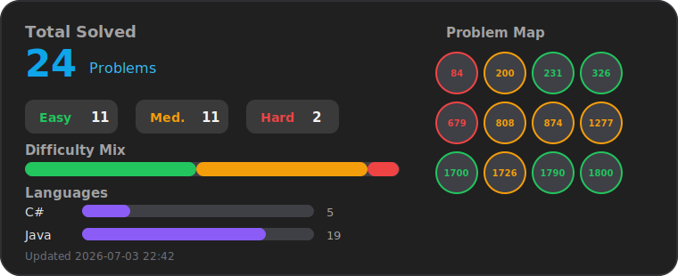

# LeetCode Solutions

Bu repo C# ve Java ile yazılmış LeetCode çözüm dosyalarını içerir.

## Yapı

Her problem kendi klasöründe tek çözüm dosyası olarak tutulur:

```text
C#/
  874. Walking Robot Simulation/
    Solution.cs

Java/
  874. Walking Robot Simulation/
    Solution.java
```

C# tarafında `.csproj` veya namespace kullanmak zorunlu değildir. LeetCode'un beklediği formatta `public class Solution` yazıp doğrudan `Solution.cs` içine yapıştırabilirsin.

Java tarafında da proje dosyası zorunlu değildir; LeetCode'a gönderdiğin `Solution.java` dosyasını klasöre eklemek yeterlidir.

## Yeni Çözüm Ekleme

1. İlgili dil klasöründe problem adıyla yeni klasör oluştur.
2. Çözümü `Solution.cs` veya `Solution.java` olarak ekle.
3. Problem zorluk bilgisini progress kartına yansıtmak istersen `metadata/problems.json` dosyasına ekle.
4. Progress kartını güncelle:

```powershell
.\scripts\update-progress.ps1
```

5. GitHub'a gönder:

```powershell
git status
git add .
git commit -m "Add <problem-name> solution"
git push
```


<!-- LEETCODE_PROGRESS_START -->
## Progress



_Generated by scripts/update-progress.ps1 on 2026-07-03 22:42._

| Metric | Count |
| --- | ---: |
| Total solved | 24 |
| Easy | 11 |
| Medium | 11 |
| Hard | 2 |

| Language | Problems |
| --- | ---: |
| C# | 5 |
| Java | 19 |
<!-- LEETCODE_PROGRESS_END -->
